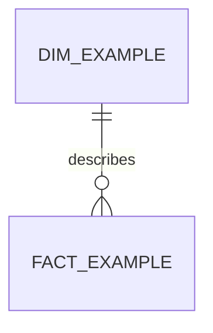

# Schema

## Grain
One row of the fact table represents: <write one sentence>.

## Tables
| Table | One row is | Key | Built from |
|---|---|---|---|
| fact_... | | | |
| dim_... | | | |

## Diagram
GitHub renders this block as a diagram. Replace it with your tables and relationships.

## Decisions
Each choice a reader might question (a dropped column, a flagged row, a derived measure) and why.
